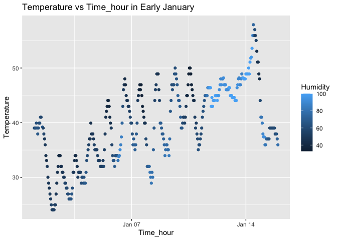

HW1
================
Ruohan Lyu

# Load the Library and Dataset

``` r
library(moderndive)
library(ggplot2)
data("early_january_weather")
```

# Describing the Dataset

## early_january_weather

The variables included in this dataset are: origin, year, month, day,
hour, temp, dewp, humid, wind_dir, wind_speed, wind_gust, precip,
pressure, visib, time_hour. Some important variables are temp, humid,
and time_hour, which will be used to create a scatterplot in the next
step.

This dataset contains 358 rows and 15 columns.

The mean temperature for the dataset is 39.5821229.

# Making a scatterplot

## Load ggplot2

``` r
library(ggplot2)
```

## Scatterplot

``` r
weather_plot <- ggplot(early_january_weather, aes(x = time_hour, y = temp, color = humid)) + 
  geom_point() + 
  labs(title = "Temperature vs Time_hour in Early January", 
       x = "Time_hour",
       y = "Temperature",
       color = "Humidity")
weather_plot
```

<!-- -->

## Saving the Plot

``` r
ggsave("scatterplot.png", plot = weather_plot, width = 8, height = 6)
```
