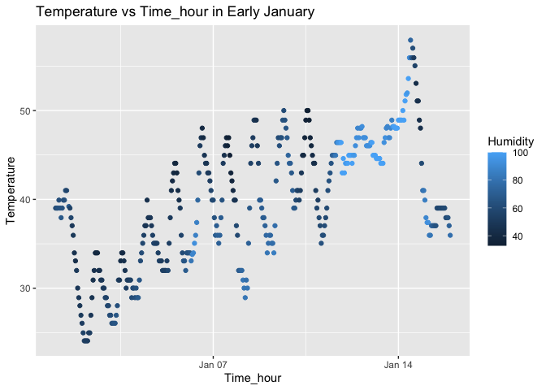

HW1
================
Ruohan Lyu

# Problem 1

## Load the Library and Dataset

``` r
library(moderndive)
library(tidyverse)
```

    ## ── Attaching core tidyverse packages ──────────────────────── tidyverse 2.0.0 ──
    ## ✔ dplyr     1.1.4     ✔ readr     2.1.5
    ## ✔ forcats   1.0.0     ✔ stringr   1.5.1
    ## ✔ ggplot2   3.5.2     ✔ tibble    3.3.0
    ## ✔ lubridate 1.9.4     ✔ tidyr     1.3.1
    ## ✔ purrr     1.1.0     
    ## ── Conflicts ────────────────────────────────────────── tidyverse_conflicts() ──
    ## ✖ dplyr::filter() masks stats::filter()
    ## ✖ dplyr::lag()    masks stats::lag()
    ## ℹ Use the conflicted package (<http://conflicted.r-lib.org/>) to force all conflicts to become errors

``` r
data("early_january_weather")
```

## Describe the Dataset

The variables included in this dataset are: origin, year, month, day,
hour, temp, dewp, humid, wind_dir, wind_speed, wind_gust, precip,
pressure, visib, time_hour. Some important variables are `temp`,
`humid`, and `time_hour`, which will be used to create a scatterplot in
the next step.

This dataset contains 358 rows and 15 columns.

The mean temperature for the dataset is 39.5821229.

## Scatterplot

### Create the Scatterplot

``` r
weather_plot <- ggplot(early_january_weather, aes(x = time_hour, y = temp, color = humid)) + 
  geom_point() + 
  labs(title = "Temperature vs Time_hour in Early January", 
       x = "Time_hour",
       y = "Temperature",
       color = "Humidity")
weather_plot
```

<!-- -->

### Describe the Plot

The plot shows that the temperature has an overall slight warming trend,
but fluctuates cyclically, being very high around midday and decreasing
overnight. In addition, there is a seemingly inverse relationship
between temperature and humidity over time. In the same day, lower
humidity always occurs with the temperature peaks, indicating a moderate
correlation between the two variables.

### Save the Plot

``` r
ggsave("scatterplot.png", plot = weather_plot, width = 8, height = 6)
```

# Problem 2

## Create Data Frame

``` r
random_sample = rnorm(10)
```

``` r
my_dataframe = data.frame(
  random_sample,
  logical_vector = random_sample > 0,
  character_vector = c("cat","dog","bird","fish","ant","bee","cow","duck","lion","tiger"),
  factor_vector = factor(c("A","B","C","A","B","C","A","B","C","A"))
)
my_dataframe #print the data frame
```

    ##    random_sample logical_vector character_vector factor_vector
    ## 1     0.06936900           TRUE              cat             A
    ## 2    -0.06613503          FALSE              dog             B
    ## 3     0.76011568           TRUE             bird             C
    ## 4     0.45138177           TRUE             fish             A
    ## 5     1.01028773           TRUE              ant             B
    ## 6    -0.19382787          FALSE              bee             C
    ## 7    -1.39841687          FALSE              cow             A
    ## 8     0.80252687           TRUE             duck             B
    ## 9    -1.31409286          FALSE             lion             C
    ## 10   -1.22430597          FALSE            tiger             A

## Take the Mean

``` r
mean(pull(my_dataframe, random_sample))
```

    ## [1] -0.1103098

``` r
mean(pull(my_dataframe, logical_vector))
```

    ## [1] 0.5

``` r
mean(pull(my_dataframe, character_vector))
```

    ## Warning in mean.default(pull(my_dataframe, character_vector)): argument is not
    ## numeric or logical: returning NA

    ## [1] NA

``` r
mean(pull(my_dataframe, factor_vector))
```

    ## Warning in mean.default(pull(my_dataframe, factor_vector)): argument is not
    ## numeric or logical: returning NA

    ## [1] NA

According to the results, the mean of `random_sample` and
`logical_vector` can be calculated as -0.1103098 and 0.5 (defined as 0
or 1). However, attempting to compute the mean of the other two vectors
returns `NA`.

## Apply the as.numeric Function

``` r
numeric_logical <- as.numeric(pull(my_dataframe, logical_vector))
numeric_character <- as.numeric(pull(my_dataframe, character_vector))
```

    ## Warning: NAs introduced by coercion

``` r
numeric_factor <- as.numeric(pull(my_dataframe, factor_vector))
```

Logical variables can be automatically converted into numbers (TRUE = 1,
FALSE = 0), which allows us to calculate the mean. Factor variables can
also be converted to numbers using the as.numeric function; however, the
resulting mean has no real interpretive meaning. Finally, character
variables cannot be converted to numbers, so it is impossible to take
the mean.

All these results explain why the mean of random_sample and
logical_vector can be calculated, while attempting to take the mean of
character or factor variables either fails or produces meaningless
values.
